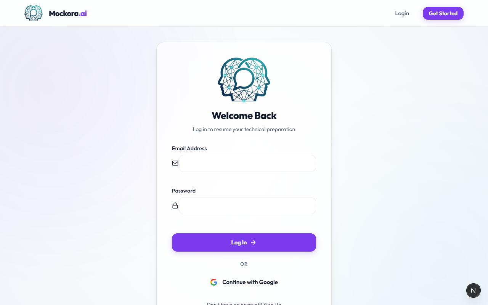
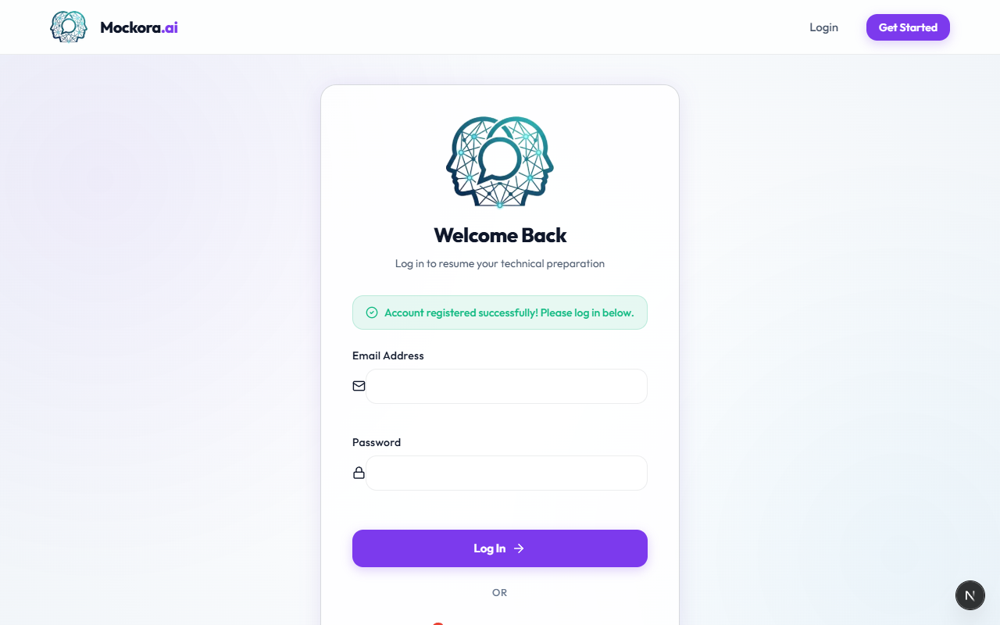
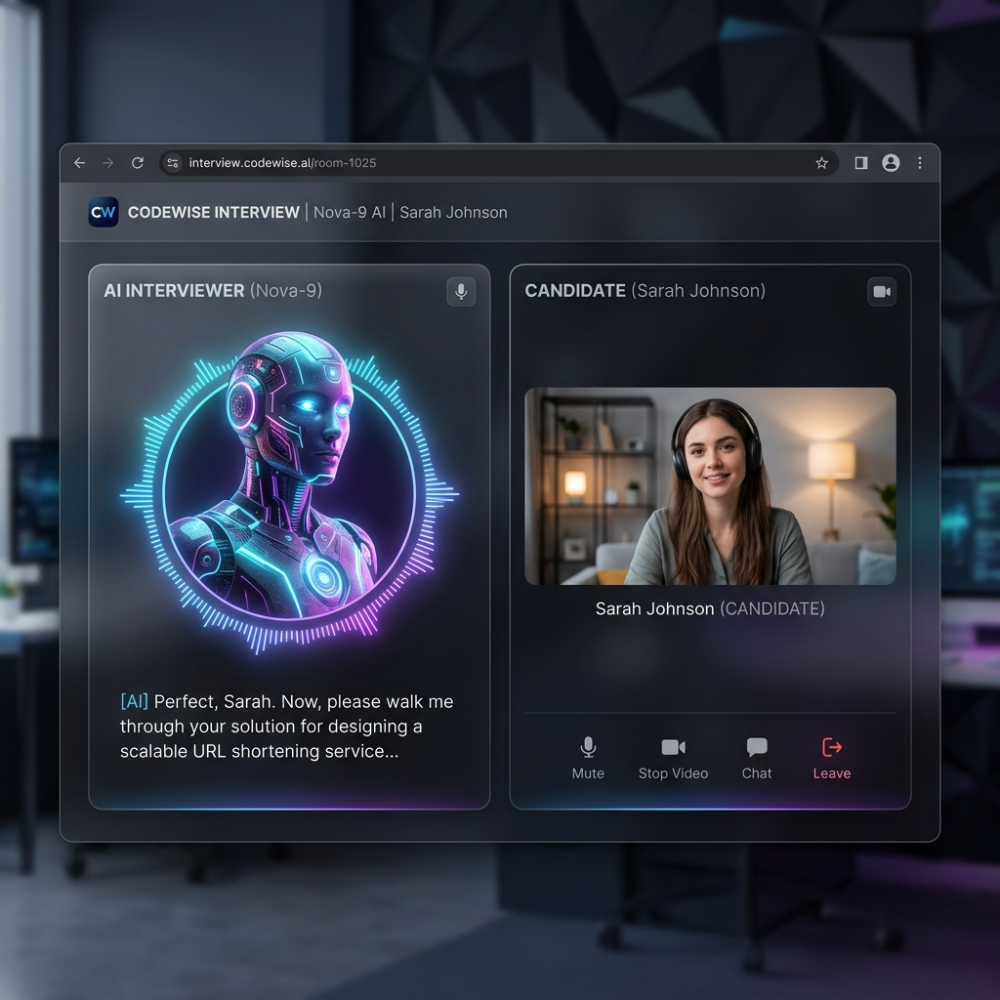

<div align="center">
  
  <h1>Mockora.ai</h1>
  <p><b>Next-Generation AI-Powered Technical Interview Platform</b></p>
  <p>
    <a href="#features">Features</a> •
    <a href="#tech-stack">Tech Stack</a> •
    <a href="#installation">Installation</a> •
    <a href="#live-demo">Live Demo</a>
  </p>
</div>

---

## 🚀 About Mockora.ai

**Mockora.ai** is an advanced platform designed to simulate real-world technical interviews using Artificial Intelligence. It helps candidates practice their interviewing skills in a realistic, pressure-free environment. 

With a sleek **Dark Mode** user interface, **Real-Time Speech Recognition**, and an interactive **3D AI Recruiter Avatar**, Mockora provides an immersive and highly professional interview experience. All responses are evaluated by the powerful Google Gemini AI model to provide actionable feedback, scoring, and learning resources.

---

## 📸 Screenshots

*(Replace these placeholders by adding your screenshots to the `public/screenshots/` folder)*

### 1. Login & Authentication

*Secure and seamless authentication with NextAuth.js and a beautiful clean UI.*

### 2. Candidate Dashboard

*Manage your past interviews, view overall scores, and track your performance trends.*

### 3. Sleek AI Interview Room

*The highly immersive dark-mode interview workspace with voice-activated AI avatar and live webcam feed.*

---

## 🌟 Key Features

- **🤖 Realistic AI Recruiter:** A modern 3D AI avatar that speaks questions out loud and reacts to your speech.
- **🎙️ Real-Time Speech-to-Text:** Live transcription of your answers using Web Speech API.
- **🎥 Live Webcam Integration:** Secure, local browser-based webcam integration (WebRTC) to simulate a real face-to-face interview.
- **🧠 Intelligent Evaluation:** Google Gemini API analyzes your answers for technical accuracy, communication skills, and provides an ideal response.
- **🎨 Premium UI/UX:** A stunning glassmorphism and dark-mode inspired design with micro-animations.
- **🔐 Secure Authentication:** Seamless login and registration using NextAuth.js.

---

## 🛠 Tech Stack

- **Frontend:** Next.js 14 (App Router), React, Tailwind CSS / Vanilla CSS
- **Backend:** Next.js Route Handlers
- **Database:** MongoDB (Mongoose)
- **AI Engine:** Google Gemini Pro (`@google/genai`)
- **Authentication:** NextAuth.js
- **Icons:** Lucide React
- **Media APIs:** WebRTC (getUserMedia), Web Speech API (SpeechRecognition & SpeechSynthesis)

---

## 🌐 Live Demo

Check out the live web application here:

**🔗 [Access Mockora.ai Live](YOUR_HOSTING_LINK_HERE)**

*(Note: Ensure you access the web app via `https://` to allow camera and microphone permissions).*

---

## 💻 Installation & Local Setup

To run this project locally on your machine:

1. **Clone the repository:**
   ```bash
   git clone https://github.com/Gnanaprakash7272/ai-interview.git
   cd ai-interview
   ```

2. **Install dependencies:**
   ```bash
   npm install
   ```

3. **Set up Environment Variables:**
   Create a `.env.local` file in the root directory and add the following:
   ```env
   # MongoDB Connection
   MONGODB_URI=your_mongodb_connection_string

   # Google Gemini API
   GEMINI_API_KEY=your_gemini_api_key

   # NextAuth
   NEXTAUTH_URL=http://localhost:3000
   NEXTAUTH_SECRET=your_nextauth_secret
   ```

4. **Run the development server:**
   ```bash
   npm run dev
   ```

5. **Open the app:**
   Navigate to [http://localhost:3000](http://localhost:3000) in your browser.

---

<div align="center">
  <i>Built with ❤️ for aspiring tech professionals.</i>
</div>
